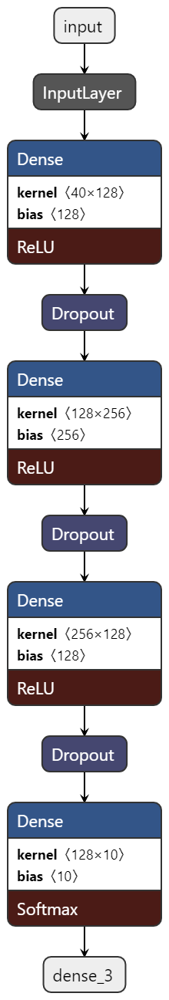

<h1 align="center"> Audio-Classifier </h1>

[](https://github.com/theAdarshSrivastava/Audio-Classifier/blob/main/LICENSE)
[](www.linkedin.com/in/theadarshsrivastava)
[](https://www.instagram.com/the_adarsh6700/)
[](https://librosa.org/)
[](https://www.tensorflow.org/)

[license-shield]: https://img.shields.io/github/license/othneildrew/Best-README-Template.svg?style=for-the-badge
[license-url]: https://github.com/theAdarshSrivastava/Audio-Classifier/blob/main/LICENSE

An audio classifier which uses simple ANN network to classify the audio of UrbanSound8k dataset upto with 90% accuracy. 
It contains librosa library which is used to analyse and extract features from the audio file.

---

# Dataset

The dataset used has 10 classes each with different audio classes. These classes are air_conditioner, car_horn, children_playing, dog_bark,drilling, engine_idling, gun_shot, jackhammer, siren, street_music.
You can download the dataset by clicking on the link given below:
[Download Dataset](https://drive.google.com/drive/folders/1U3mRpjfYVtvMi9zVGi3fmK-r8OkW-Q7x?usp=sharing)~5.6 GB

---

# Architecture



---

# Model

You can download the model by just clicking on the link mentioned below:
[Download Model](https://drive.google.com/file/d/1qDyDnWHc2wwPxHf7MUUeOEQfl23geonM/view?usp=sharing)

---

# Usage

1. Installing the required softwares:-
   ```bash
   pip install -r requirements.txt
   ```
2. Cloning the repository:-
   ```bash
   git clone https://github.com/theAdarshSrivastava/Audio-Classifier/.git
   ```
3. Run the Audio_Classification.ipynb using jupyter notebook

---
